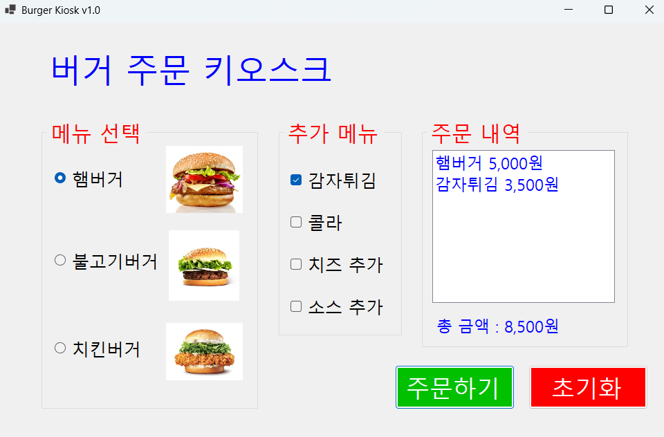
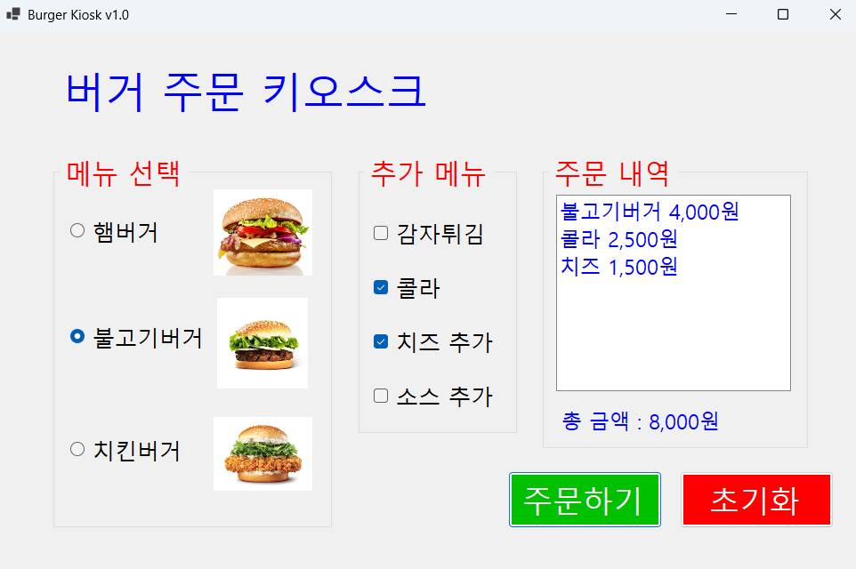
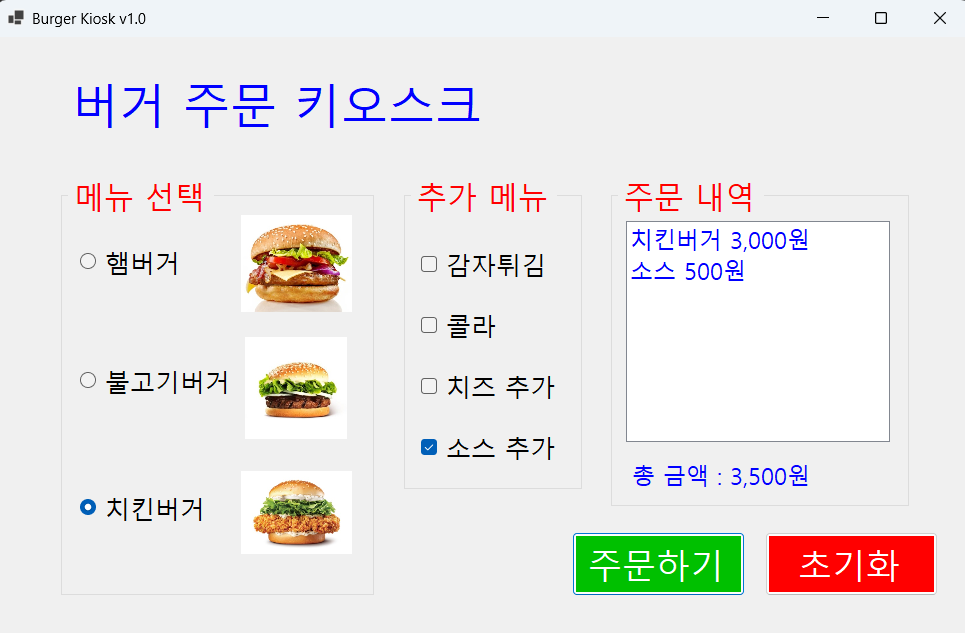
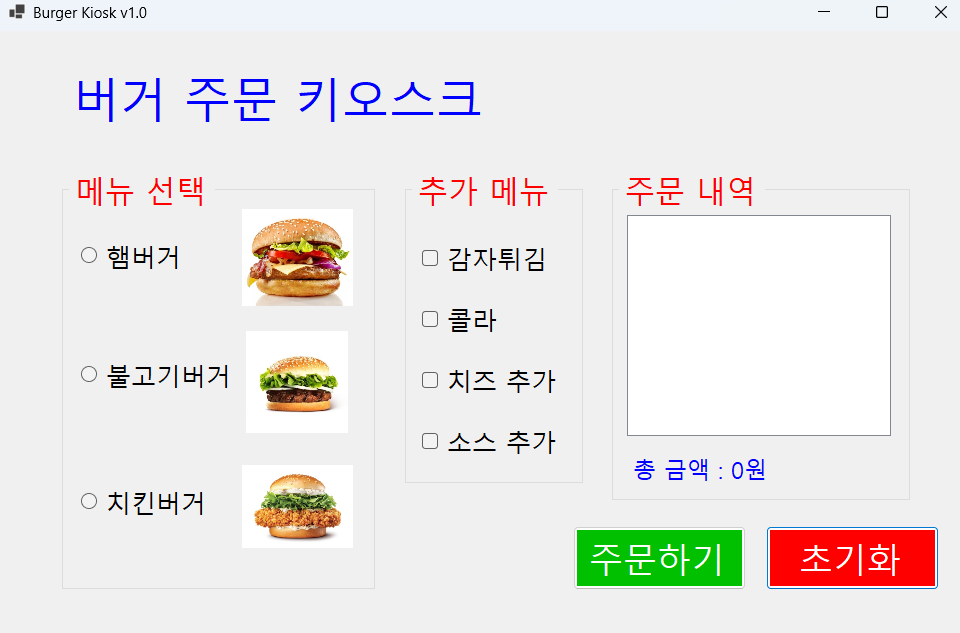
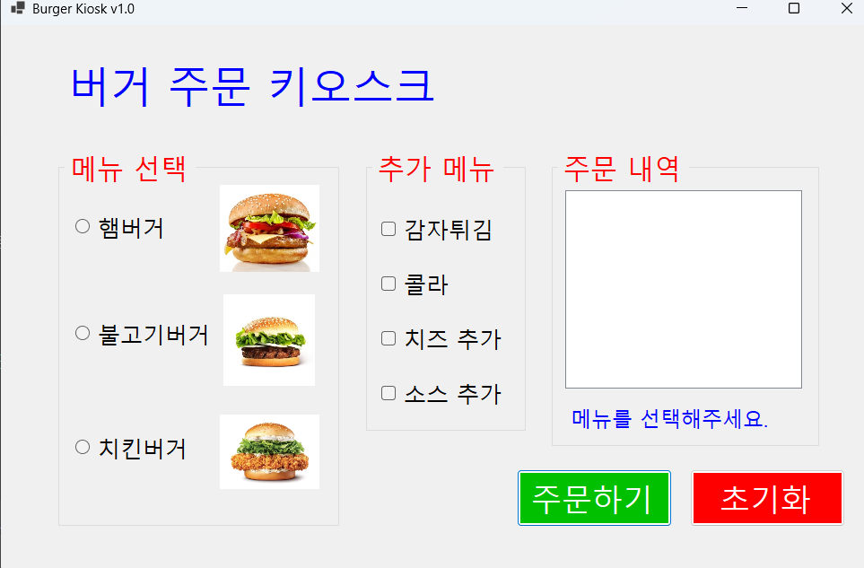
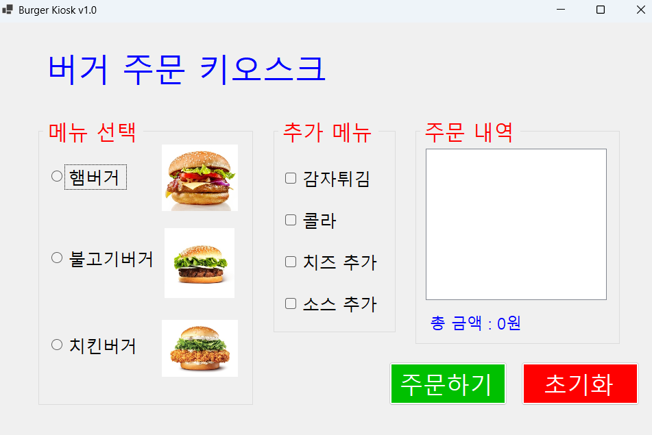
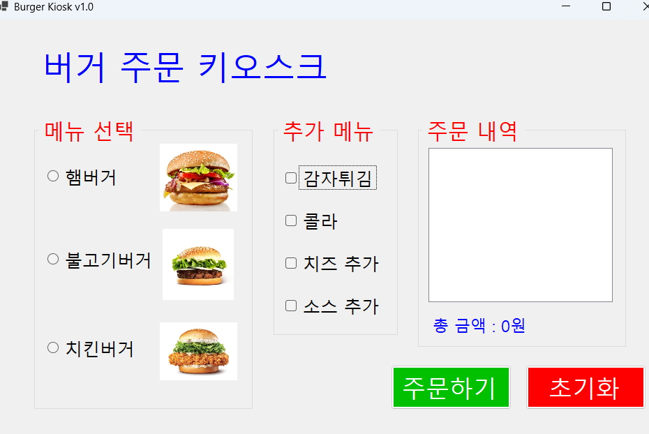
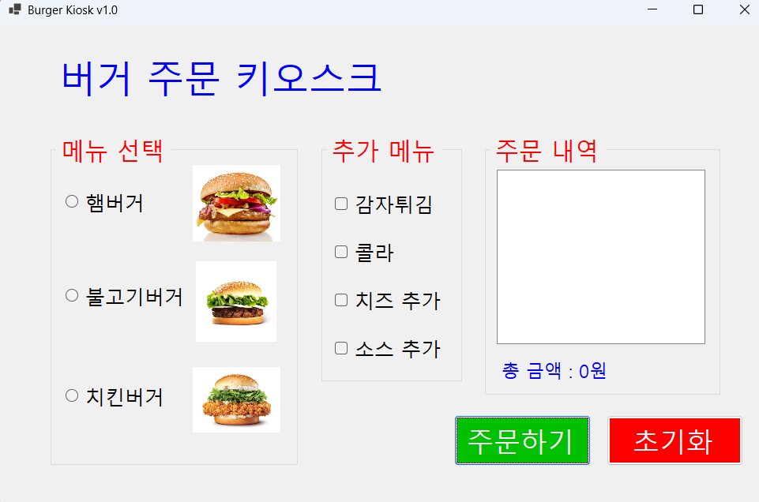
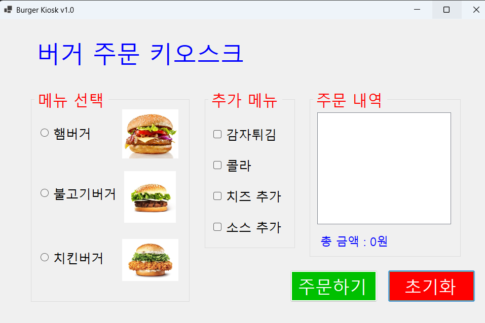

# (C# 코딩) 햄버거 키오스크
## 개요
- C# 프로그래밍 학습
- 1줄 소개: 햄버거 주문 키오스크 프로그램

- 사용한 플랫폼:
- C#, .NET Windows Forms, Visual Studio, GitHub

- 사용한 컨트롤:
- Label, ListBox, Button, PictureBox, RadioButton, CheckBox, GroupBox

- 사용한 기술과 구현한 기능:
- 메뉴 선택 기능: RadioButton을 활용한 단일 메뉴 선택
- 옵션 선택 기능: CheckBox를 활용한 복수 선택 처리
- 가격 계산 기능: 선택된 항목들의 가격을 합산
- 이벤트 처리: 버튼 클릭 시 전체 로직 실행
- 조건문 활용: 선택 여부에 따른 분기 처리
- UI 업데이트: 사용자 입력에 따라 화면 즉시 반영

## 배운 내용
- 컨트롤 배치와 기본적인 속성 설정
- 선택된 항목 추출 기능 구현

## 실행 화면(과제1)
- 코드의 실행 스크린샷과 구현 내용 설명

- 구현한 내용 (위 그림 참조)
1. UI 구성
- RadioButton과 CheckBox 등을 적절히 배치합니다.
- GroupBox로 적절하게 그룹으로 묶어 사용자 친화적인 인터페이스를 만들고 라디오버튼 영억을 생성합니다.
2. 주문하기 버튼과 초기화 버튼의 기능 구현
- 주문하기 버튼을 누르면 선택된 메뉴와 옵션을 기반으로 총 가격을 계산하여 Label에 표시합니다. 
- 초기화 버튼을 누르면 모든 선택을 초기화하고 총 금액을 0으로 설정합니다. 

## 실행 화면
- 코드의 실행 스크린샷과 구현 내용 설명

- 구현한 내용 (위 그림 참조)
- 아무것도 선택하지 않고 주문하기 버튼을 누르면 조건문을 활용하여 라벨에 "메뉴를 선택해주세요" 출력한다.
- 선택했을경우 기존 주문하기 기능을 수행합니다.

## 실행 화면
- 코드의 실행 스크린샷과 구현 내용 설명

- 구현한 내용 (위 그림 참조)
1. Tab을 이용해서 GroupBox 와 버튼 사이를 이동하게 제작하였습니다.
2. 방향키를 이용해서 선택 아이템 사이를 이동하게 제작하였습니다.
3. 스페이스바를 이용해서 아이템 선택할 수 있게 제작하였습니다.
4. Enter키로 버튼을 누를 수 있게 제작하였습니다.